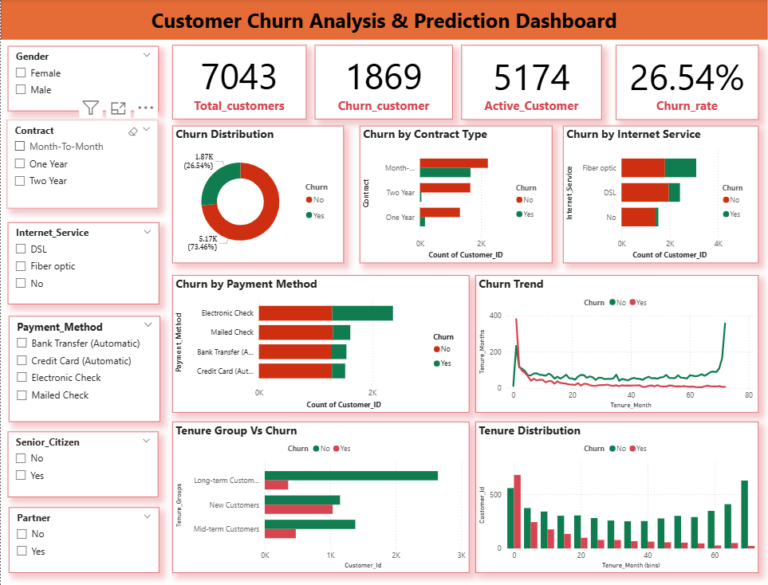

# 📊 Customer Churn Analysis & Prediction (Power BI)

## 🚀 Project Overview
This project focuses on analyzing customer churn in a telecommunications company using Power BI. The goal is to identify key factors influencing churn and provide actionable insights to improve customer retention.

---

## 🎯 Objectives
- Analyze customer behavior and churn patterns  
- Identify high-risk customer segments  
- Understand impact of tenure, demographics, and services on churn  
- Build an interactive dashboard for business insights  

---

## 🛠️ Tools & Technologies
- Power BI  
- Power Query (Data Cleaning & Transformation)  
- DAX (Data Analysis Expressions)  

---

## 📂 Project Structure

---

## 📊 Dashboard Components

### 🔹 Churn Rate Overview
- KPI Cards (Total Customers, Churn Rate, Active Customers)  
- Donut Chart (Churn Distribution)  

### 🔹 Customer Demographics
- Churn by Gender  
- Churn by Partner  
- Churn by Dependents  

### 🔹 Customer Tenure Analysis
- Tenure Distribution (Histogram)  
- Churn Trend (Line Chart)  
- Tenure Group Analysis  

### 🔹 Churn Analysis
- Churn by Contract Type  
- Churn by Payment Method  
- Churn by Internet Service  

---

## 📈 Key Insights
- 📌 Overall churn rate is around **26–27%**  
- 📌 Month-to-Month contracts have the highest churn  
- 📌 Electronic Check users churn more frequently  
- 📌 High churn observed in early tenure (0–12 months)  
- 📌 Long-term customers show strong retention  

---

## 📸 Dashboard Preview

---

## ✅ Project Outcome
- Built an end-to-end churn analysis dashboard  
- Applied data cleaning, transformation, and visualization  
- Generated actionable business insights  

---

## 🚀 Key Learning
- Data cleaning using Power Query  
- KPI creation using DAX  
- Dashboard design and storytelling  
- Customer behavior analysis  

---

## 👩‍💻 Author
**Kalyani Gunjal**  
Aspiring Data Analyst  

---

## 🔗 Connect with Me
- LinkedIn: (Add your link)  
- GitHub: (Your profile link)
