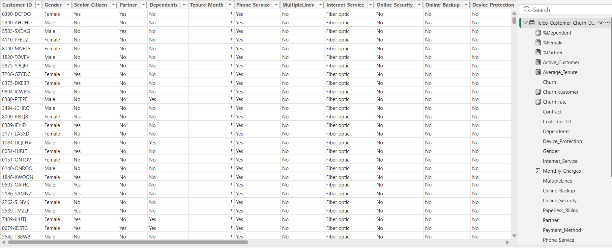

📥 Task 1: Data Connection (Power BI)

🎯 Objective
Import the customer churn dataset into Power BI to enable data visualization and analysis.

---

## 📂 Dataset Overview

The dataset represents customer information from a **telecommunications company** and is widely used for churn analysis.

### 📊 Dataset Size:
- **Total Rows:** 7043  
- **Total Columns:** 21  
---

🛠️ Steps Performed
1. Opened Power BI Desktop  
2. Clicked on **Get Data**  
3. Selected data source (CSV)  
4. Loaded dataset into Power BI  
5. Verified data preview and column structure  

---

---
💡 Key Learning

- Learned how to import data into Power BI  
- Understood dataset structure and business context  
- Prepared data foundation for further analysis  
