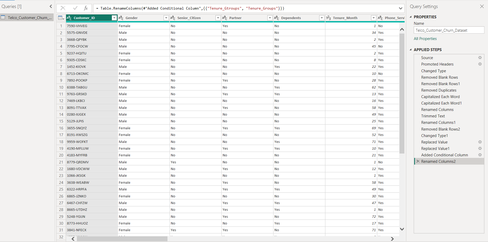

🔄 Task 2: Data Transformation (Power BI)

🎯 Objective
The objective of this task is to clean and transform the raw dataset to make it suitable for analysis and visualization in Power BI.

---

📂 Dataset Summary

- **Total Rows:** 7043  
- **Total Columns:** 21  

The dataset contains customer information from a telecom company, including demographics, services, billing, and churn status.

---

🛠️ Data Cleaning & Transformation Steps

### 🔹 1. Removed Blank Rows
- Identified and removed rows with null or empty values  
- Ensured dataset consistency  

---

### 🔹 2. Removed Duplicates
- Checked for duplicate `Customer_ID`  
- Removed duplicate records to maintain data integrity  

---

### 🔹 3. Changed Data Types
- Converted columns to appropriate formats:
  - `Tenure_Month` → Whole Number  
  - `Monthly_Charges` → Decimal  
  - `Total_Charges` → Decimal  
  - Categorical columns → Text  

---

### 🔹 4. Handled Missing Values
- Replaced null or blank values where necessary  
- Ensured no errors in numerical columns  

---

### 🔹 5. Standardized Text Values
- Applied **Trim** and **Clean** functions  
- Capitalized values for consistency (e.g., Yes/No)  

---

### 🔹 6. Fixed Inconsistent Categories

#### 📌 Senior Citizen Column
- Converted values:
  - `0 → No`  
  - `1 → Yes`  

#### 📌 Multiple Lines Column
- Handled values:
  - `No phone service` kept as separate category  
  - Ensured no confusion with `No`  

---

### 🔹 7. Renamed Columns
- Renamed columns for better readability:
  - Example: `tenure` → `Tenure_Month`  

---

### 🔹 8. Created New Columns (Feature Engineering)

#### 📌 Tenure Group
Created a new column to categorize customers:

- 0–12 months → **New Customers**  
- 13–36 months → **Mid-term Customers**  
- 37+ months → **Long-term Customers**  

---

### 🔹 9. Verified Data Quality
- Checked for:
  - Null values  
  - Data type errors  
  - Inconsistent categories  

---

📸 Data Transformation Screenshot

---

💡 Key Learning

- Learned data cleaning techniques in Power BI  
- Understood importance of data preprocessing  
- Applied real-world data transformation steps  

---
