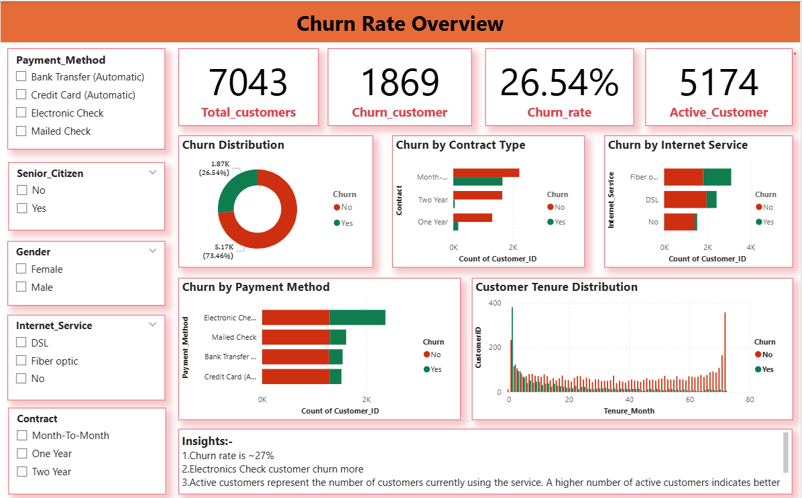
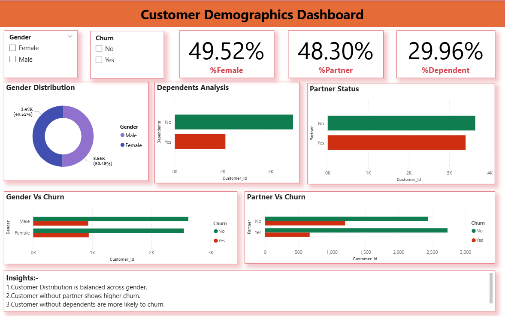
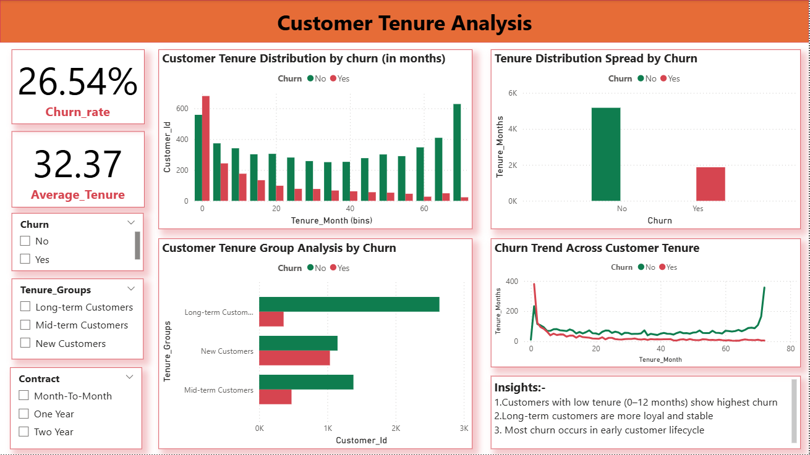
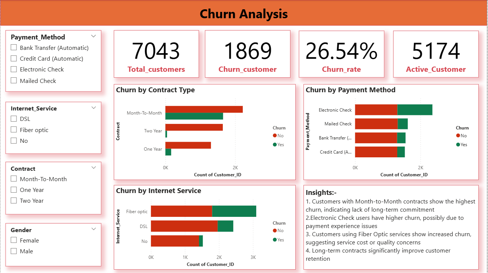

## 📊 Task 3: Dashboard Component (Power BI)

## 🎯 Objective
The objective of this task is to build a comprehensive and interactive dashboard to analyze customer churn, understand customer behavior, and identify key factors affecting retention.

---

## 📂 Dataset Summary
- **Total Customers:** 7043  
- **Total Columns:** 21  
- Dataset includes customer demographics, tenure, services, billing, and churn status  

---

## 🔹 A. Churn Rate Overview

# 🎯 Objective
Display an overview of the churn rate,indicating the percentage of the customer who have rate churned.

## 📊 Visuals Used
- KPI Cards:
  - Total Customers  
  - Churned Customers  
  - Active Customers  
  - Churn Rate (%)  
- Donut Chart – Churn Distribution  

## 📈 Key Insights
- 📌 Overall churn rate is approximately **26–27%**  
- 📌 Majority of customers are active, but a significant portion has churned  

---

---

# 🔹 B. Customer Demographics

## 📊 Visuals Used
- Bar Chart – Churn by Gender  
- Bar Chart – Churn by Partner  
- Bar Chart – Churn by Dependents  

## 📈 Key Insights
- 📌 Customers without partners show higher churn  
- 📌 Customers without dependents are more likely to churn  
- 📌 Gender has minimal impact on churn behavior

---

---

# 🔹 C. Customer Tenure Analysis

## 📊 Visuals Used
- Histogram – Tenure Distribution  
- Line Chart – Churn Trend Across Tenure  
- Bar Chart – Tenure Group vs Churn  
- Box Plot – Tenure Spread  

## 📈 Key Insights
- 📌 High churn observed in early tenure (0–12 months)  
- 📌 Churn decreases as tenure increases  
- 📌 Long-term customers show strong retention

---

---

# 🔹 D. Churn Analysis

## 📊 Visuals Used
- Bar Chart – Churn by Contract Type  
- Bar Chart – Churn by Payment Method  
- Bar Chart – Churn by Internet Service  

## 📈 Key Insights
- 📌 Month-to-Month contracts have highest churn  
- 📌 Electronic Check users show higher churn  
- 📌 Fiber Optic customers tend to churn more  
- 📌 Long-term contracts improve retention  

---

---

## 🎛️ Interactive Features

### Slicers Used:
- Gender  
- Contract  
- Internet Service  
- Payment Method  

👉 Enables dynamic filtering and better analysis  

---

## 🚀 Key Learning
- Dashboard design and layout structuring  
- KPI creation using DAX  
- Advanced data visualization techniques  
- Business insight generation from data  
